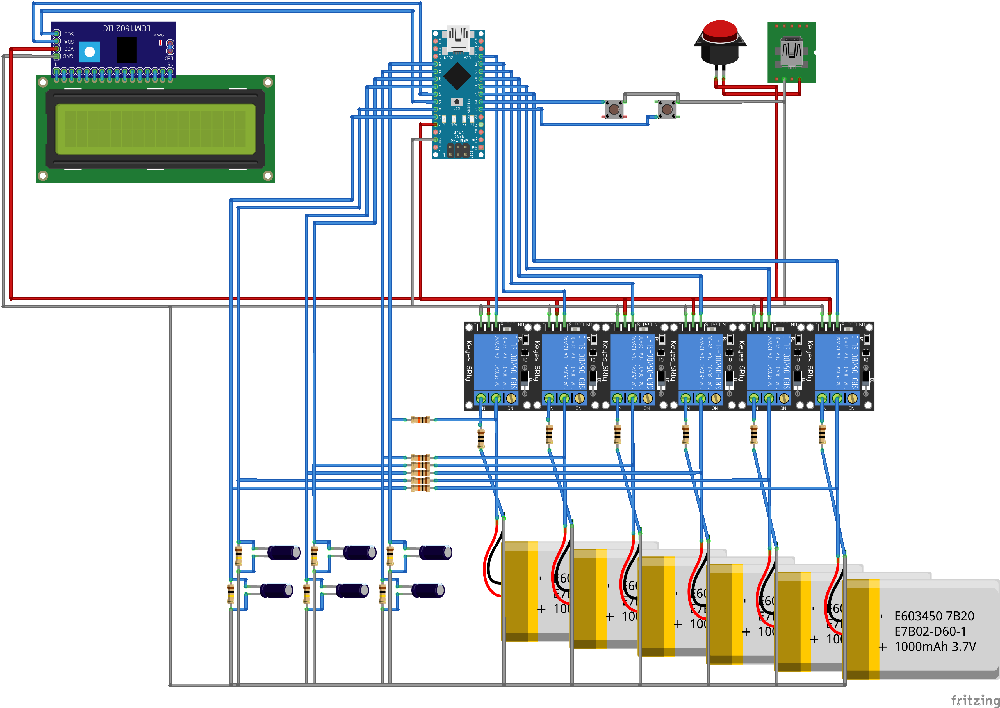

# Steppe
Just another one Li-ion discharger and maybe even charger in the future? who knows. Let's find out 

# Schematic

# TODO 
* add charger
* use transistors instead of relays
* use multiplexer to discharge more batteries at once? 
